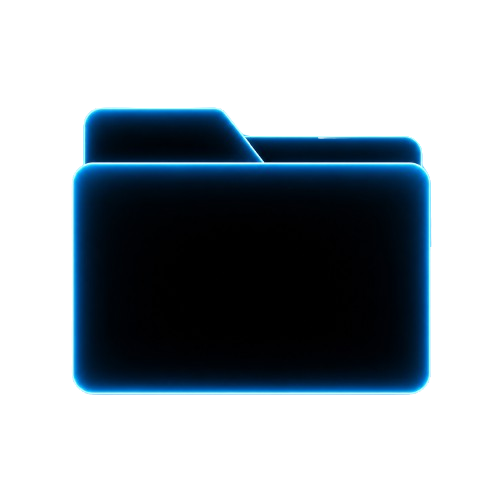
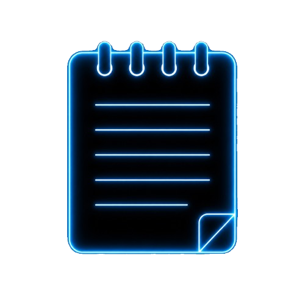
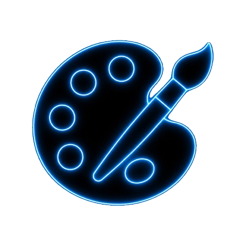
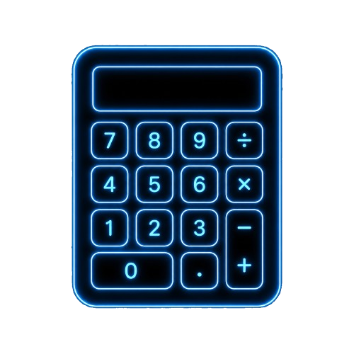
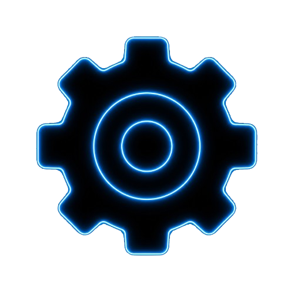

# Flexity

### *The Flexible Core*

*A minimalist, futuristic and optimized operating system built from scratch.*

---

## 🌀 About Flexity

**Flexity** is an operating system built completely from scratch.

No Linux base. No Windows base. No shortcuts.

Just pure code, designed to be **fast**, **clean**, **beautiful** and **optimized for gaming**.

---

## 🎨 Aesthetic

| Element | Value |
|---------|-------|
| Background | `#000000` Pure Black |
| Accent | `#00FFFF` Cyan Neon |
| Style | Minimalist / Futuristic |
| Mood | Dark / Glow / Clean |

---

## 🎨 Icon Pack

### *Flexity Style — Cyan Glow Edition*

**5 hand-crafted icons** with consistent design, perfect glow and pure black aesthetic.

*More icons coming soon...*

---

## ✨ Features (Planned)

### Core
- ⚡ Custom Bootloader (Assembly) ✅
- 🧠 Custom Kernel (C)
- 💾 Memory Management
- ⌨️ Keyboard & Mouse Drivers
- 🖼️ Custom Graphics Engine

### Interface
- 🖥️ Minimalist Desktop
- 📊 Customizable Taskbar
- 🔍 Searchable Start Menu
- 🪟 Floating Windows with Cyan Glow
- 🌑 Pure Dark Theme

### Apps
- 📁 File Manager
- 🎨 Paint
- 🔢 Calculator
- 📝 Notes
- ⬛ Terminal
- 🎵 Music Player
- 🖼️ Gallery
- 🌐 Browser (FlexBrowser)
- 🌤️ Weather
- ⚙️ Settings

### Performance
- 🎮 Gaming Mode
- ⚡ Ultra Optimized
- 🪶 Lightweight
- 🚀 Fast Boot

---

## 🗺️ Roadmap

- [x] Project Concept
- [x] Logo Design
- [x] GitHub Repository
- [x] Icon Pack (Basic Set)
- [x] First Bootloader
- [ ] Bootloader with Cyan Style
- [ ] Basic Kernel (C)
- [ ] Memory Management
- [ ] Keyboard Driver
- [ ] Display Driver (Framebuffer)
- [ ] Graphics Engine
- [ ] Window System
- [ ] Desktop Environment
- [ ] Applications
- [ ] First ISO Release

---

## 🛠️ Built With

| Tech | Purpose |
|------|---------|
| **C** | Kernel & Drivers |
| **Assembly (NASM)** | Bootloader |
| **QEMU** | Testing & Emulation |
| **Make** | Build System |
| **Git** | Version Control |

---

## 📂 Project Structure
Flexity/
├── assets/
│ └── icons/ # Flexity icon pack
├── bootloader/ # Boot sector code (ASM)
├── kernel/ # Core kernel (C)
├── build/ # Compiled binaries
├── logo.png # Official logo
└── README.md

---

## 🚀 Status

> 🚧 **In Active Development**
> 
> Flexity is being built from the ground up. This is a long-term passion project.

---

## 💡 Philosophy

> *"The system should adapt to you, not the other way around."*

Flexity is built around three pillars:

1. **Minimalism** — Only what you need
2. **Performance** — Fast on any hardware
3. **Aesthetic** — Beautiful by default

---

## 📜 License

Open Source — Free for everyone.

---

### *Made with 🔥 from scratch*

**Flexity**

